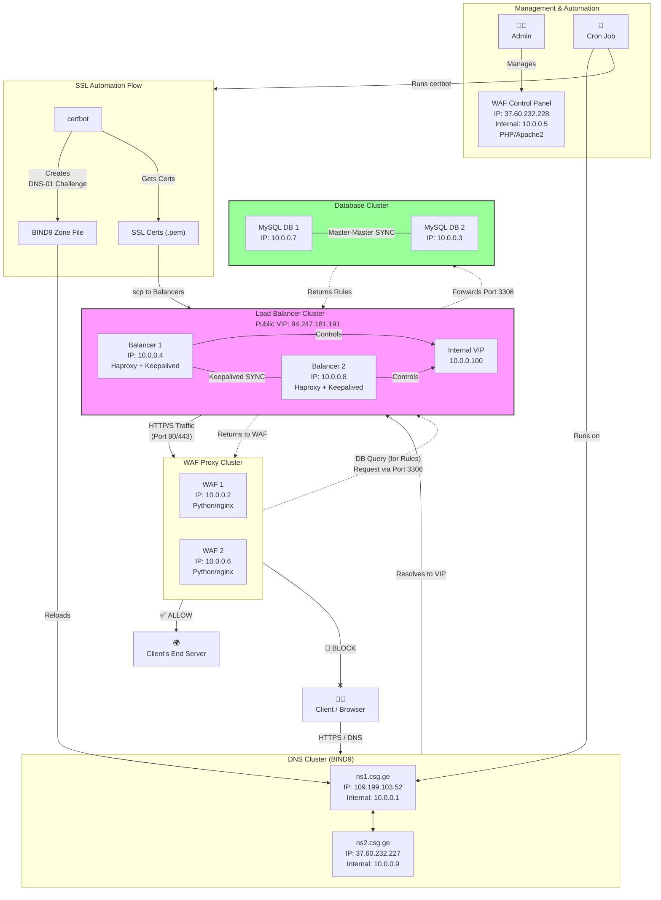

# დოკუმენტაცია: SSL სერტიფიკატების მართვისა და განახლების პროტოკოლი

## 1. შესავალი

წინამდებარე დოკუმენტი აღწერს WAF (Web Application Firewall) სისტემისთვის SSL/TLS სერტიფიკატების გაცემისა და განახლების ავტომატიზებულ პროცესს. სისტემა დაპროექტებულია მინიმალური ადამიანური ჩარევისთვის და იყენებს ინდუსტრიაში სტანდარტულ ინსტრუმენტებს, როგორებიცაა `certbot`, BIND9 და `HAProxy`.

მთელი პროცესი იმართება ცენტრალიზებულად, DNS სერვერიდან და ავტომატურად ანაწილებს განახლებულ სერტიფიკატებს Load Balancer-ის კვანძებზე.

---

## 2. სისტემის არქიტექტურა და სამუშაო პროცესი

სისტემის მუშაობის ციკლი შედგება შემდეგი ეტაპებისგან:

1.  **პროცესის ინიცირება:** პროცესი იწყება DNS სერვერზე განთავსებული მთავარი მმართველი სკრიპტის გაშვებით.

2.  **დომენების აღმოჩენა:** სკრიპტი უკავშირდება პროდაქშენის მონაცემთა ბაზას (`CSG_waf`) და SQL მოთხოვნის საშუალებით იღებს იმ ვებსაიტების სიას, რომლებიც აქტიურია და საჭიროებს SSL სერტიფიკატს (`is_verified=1`).

3.  **სერტიფიკატის გაცემა (თითოეული დომენისთვის):**
    * სკრიპტი იძახებს `certbot`-ს `DNS-01` ვალიდაციის მეთოდის გამოყენებით. ეს მეთოდი არ მოითხოვs ვებ-სერვერზე წვდომას.
    * `certbot` ავტომატურად უშვებს `auth-hook` სკრიპტს (`hooks/auth-hook.sh`), რომელიც დროებით ამატებს `_acme-challenge` TXT ჩანაწერს შესაბამისი დომენის BIND9 ზონის ფაილში.
    * ზონის ფაილის განახლების შემდეგ, სკრიპტი იძახებს `rndc reload` ბრძანებას DNS სერვისის ცვლილებების გასააქტიურებლად.
    * ვალიდაციის წარმატებით დასრულების შემდეგ, `certbot` იძახებს `cleanup-hook` სკრიპტს (`hooks/cleanup-hook.sh`), რომელიც შლის დროებით TXT ჩანაწერს.

4.  **სერტიფიკატის განაწილება (Deployment):**
    * ახლად გაცემული სერტიფიკატი (`fullchain.pem`) და პირადი გასაღები (`privkey.pem`) ერთიანდება ერთ `.pem` ფაილში, რომელიც თავსებადია `HAProxy`-სთან.
    * გაერთიანებული `.pem` ფაილი `scp`-ის მეშვეობით უსაფრთხოდ იგზავნება ყველა Load Balancer კვანძზე (`10.0.0.4`, `10.0.0.8`) და თავსდება `/etc/haproxy/certs/` დირექტორიაში.
    * `HAProxy` კონფიგურირებულია ისე, რომ ავტომატურად, სერვისის მანუალური გადატვირთვის გარეშე, წაიკითხოს და გამოიყენოს განახლებული სერტიფიკატები ამ დირექტორიიდან.

---

## 3. სისტემის კომპონენტები (სკრიპტები)

სისტემა შედგება რამდენიმე სკრიპტისგან, თუმცა ოპერირებისთვის საჭიროა მხოლოდ ერთის გაშვება.

* **`automation.sh` (მთავარი სკრიპტი):** ეს არის სისტემის მმართველი სკრიპტი. მისი პასუხისმგებლობაა მონაცემთა ბაზიდან დომენების წამოღება და თითოეული მათგანისთვის სერტიფიკატის გაცემისა და განაწილების პროცესის ინიცირება. **ეს ერთადერთი სკრიპტია, რომელიც ხელით უნდა გაიშვას.**
* **`run.sh` (მანუალური/სატესტო სკრიპტი):** განკუთვნილია მხოლოდ ერთი, კონკრეტული დომენის სერტიფიკატის გასაახლებლად. გამოიყენება მხოლოდ დიაგნოსტიკისა და ტესტირების მიზნით.
* **`hooks/auth-hook.sh` (ავტორიზაციის სკრიპტი):** დამხმარე სკრიპტი, რომელსაც `certbot` იძახებს `DNS-01` ვალიდაციის შესასრულებლად. მისი დანიშნულებაა DNS ზონაში TXT ჩანაწერის დამატება.
* **`hooks/cleanup-hook.sh` (გასუფთავების სკრიპტი):** დამხმარე სკრიპტი, რომელსაც `certbot` იძახებს ვალიდაციის შემდეგ, რათა წაშალოს დროებითი TXT ჩანაწერი DNS ზონიდან.

---

## 4. შესრულების პროცედურა

სისტემის გასაშვებად და ყველა საჭირო დომენისთვის სერტიფიკატის გასაცემად/გასაახლებლად, მიჰყევით ქვემოთ მოცემულ ნაბიჯებს.

### 4.1. წინაპირობები

* SSH წვდომა ძირითად DNS სერვერზე (`109.199.103.52` ან `37.60.232.227`).
* `root` მომხმარებლის პრივილეგიები სერვერზე.

### 4.2. შესრულების ნაბიჯები

1.  **სერვერთან დაკავშირება:**
    ```bash
    ssh root@109.199.103.52
    ```

2.  **სამუშაო დირექტორიაში გადასვლა:**
    ```bash
    cd /opt/sslify
    ```

3.  **მთავარი სკრიპტის გაშვება:**
    ```bash
    sudo bash automation.sh
    ```

პროცესის დასრულების შემდეგ, სკრიპტი დაასრულებს მუშაობას. ტერმინალში გამოტანილი ინფორმაცია ასახავს შესრულების შედეგებს.

### 4.3. რეკომენდებული ავტომატიზაცია (Cron Job)

სისტემის სრული ავტომატიზაციისთვის, რეკომენდებულია Cron Job-ის დამატება, რომელიც პერიოდულად (მაგ. ყოველ ღამე) გაუშვებს მმართველ სკრიპტს.

გახსენით `crontab` რედაქტორი:
```bash
sudo crontab -e
```

და დაამატეთ შემდეგი ხაზი:

```
0 3 * * * /usr/bin/sudo /bin/bash /opt/sslify/automation.sh > /var/log/ssl_automation_daily.log 2>&1
```

ეს ჩანაწერი უზრუნველყოფს სკრიპტის ავტომატურ გაშვებას ყოველ ღამე, **03:00** საათზე. შესრულების შედეგები ჩაიწერება `/var/log/ssl_automation_daily.log` ფაილში.

## 5. ვალიდაცია და პრობლემების მოგვარება

### 5.1. წარმატების ვალიდაცია
 * სკრიპტის გამომავალი (Output): დააკვირდით ტერმინალში გამოტანილ შეტყობინებებს. წარმატებით დასრულების შემთხვევაში, გამოჩნდება შესაბამისი შეტყობინებები სერტიფიკატების კოპირების შესახებ.
 * ფაილების შემოწმება Load Balancer-ზე: შედით LB სერვერზე და შეამოწმეთ შესაბამისი .pem ფაილის განახლების თარიღი `/etc/haproxy/certs/` დირექტორიაში `ls -l` ბრძანებით.
 * ვებ-ბრაუზერით შემოწმება: გახსენით ნებისმიერი განახლებული დომენი ბრაუზერში და შეამოწმეთ SSL სერტიფიკატის მოქმედების ვადა.

### 5.2. შესაძლო პრობლემები და ლოგები
 * DNS გავრცელება: თუ auth-hook სკრიპტი ვერ ახერხებს DNS ჩანაწერის ვალიდაციას, შეამოწმეთ ლოგ ფაილი /var/log/sslify-auth.log.
 * BIND9 სერვისის პრობლემა: თუ rndc reload ბრძანება ვერ სრულდება, შეამოწმეთ BIND9-ის სისტემური ლოგები (journalctl -u bind9).
 * Firewall/ქსელის პრობლემა: თუ scp ბრძანება ვერ ახერხებს ფაილების კოპირებას, დარწმუნდით, რომ DNS სერვერსა და Load Balancer-ებს შორის ქსელური წვდომა დაშვებულია 22-ე პორტზე.


## 6. სისტემის არქიტექტურა და მაღალი ხელმისაწვდომობა (High Availability)

სისტემა დაპროექტებულია კრიტიკული კომპონენტების დუბლირებით, რათა უზრუნველყოს სერვისის უწყვეტობა და მაღალი ხელმისაწვდომობა (High Availability). ქვემოთ აღწერილია ძირითადი კომპონენტების კონფიგურაცია.


### 6.1. Load Balancers და Keepalived
სისტემაში გამოიყენება ორი **Load Balancer** (`10.0.0.4` და `10.0.0.8`) აქტიურ/პასიურ რეჟიმში, Keepalived სერვისის მეშვეობით.

 - Keepalived უზრუნველყოფს ვირტუალური IP მისამართის (VIP) შექმნას, რომელიც დინამიურად ენიჭება ერთ-ერთ Load Balancer-ს.
 - ნორმალურ რეჟიმში, მთელი ტრაფიკი მიემართება ძირითად (MASTER) ბალანსერზე.
 - თუ ძირითადი ბალანსერი გაითიშება, Keepalived ავტომატურად გადაამისამართებს ვირტუალურ IP-ს სარეზერვო (BACKUP) ბალანსერზე.
 - ეს პროცესი მომხმარებლისთვის შეუმჩნეველია და უზრუნველყოფს სერვისის უწყვეტობას.

### 6.2. მონაცემთა ბაზის რეპლიკაცია

მონაცემთა ბაზები (`10.0.0.7` და `10.0.0.3`) მუშაობენ Master-Master რეპლიკაციის რეჟიმში.

 - **Master-Master** რეპლიკაცია ნიშნავს, რომ ორივე ბაზის სერვერი არის აქტიური, შეუძლია მიიღოს როგორც წაკითხვის, ასევე ჩაწერის მოთხოვნები.
 - ნებისმიერ სერვერზე განხორციელებული ცვლილება (მაგ. ახალი WAF წესის დამატება) ავტომატურად სინქრონიზდება მეორე სერვერთან.
 - ეს სტრუქტურა არა მხოლოდ უზრუნველყოფს მონაცემების ასლის არსებობას, არამედ ამცირებს დატვირთვას და გამორიცხავს ერთი წერტილის გათიშვის რისკს (Single Point of Failure).

## 7. მოთხოვნის სრული გზა (End-to-End Request Flow)

ეს სექცია დეტალურად აღწერს იმ სრულ გზას, რომელსაც მომხმარებლის მოთხოვნა გადის WAF-ის ინფრასტრუქტურაში.

1. **DNS კონფიგურაცია**: კლიენტი საკუთარი დომენის მართვის პანელში უთითებს ჩვენს DNS Name სერვერებს (ns1.csg.ge, ns2.csg.ge). ჩვენი სისტემა პერიოდულად ამოწმებს ამ ჩანაწერის არსებობას, რათა მოხდეს დომენის ვალიდაცია.

2. **მოთხოვნის ინიცირება**: მომხმარებელი ხსნის თავის დომენს (example.com) ბრაუზერში.

3. **DNS რეზოლუცია**: მოთხოვნა იგზავნება ჩვენს DNS სერვერებთან (10.0.0.1, 10.0.0.9), რომლებიც აბრუნებენ Load Balancer -ის გლობალურ ვირტუალურ IP მისამართს (VIP).

4. **Load Balancer**: ტრაფიკი ხვდება აქტიურ Load Balancer-ზე (10.0.0.4 ან 10.0.0.8).
   - თუ მოთხოვნა შემოდის პორტ **80/443**-ზე (HTTP/HTTPS), **HAProxy** გადაამისამართებს მას WAF (Proxy) სერვერზე (`10.0.0.2` ან `10.0.0.6`).

5. **WAF (Web Application Firewall)**: Python-ზე დაწერილი WAF იღებს მოთხოვნას და იწყებს მის ანალიზს.
   - ანალიზისთვის, WAF-ს სჭირდება უსაფრთხოების წესები (Rules) მონაცემთა ბაზიდან.
   - WAF აგზავნის მოთხოვნას მონაცემთა ბაზასთან დასაკავშირებლად, რომელიც ისევ Load Balancer -ისკენ მიემართება პორტ 3306-ზე (MySQL პორტი).


6. **ბაზასთან კავშირი**: Load Balancer-ი იღებს 3306 პორტზე შემოსულ მოთხოვნას და გადაამისამართებს მას აქტიურ Master-Master ბაზის სერვერზე (10.0.0.7 ან 10.0.0.3).

7. **წესების შემოწმება**: WAF იღებს წესებს ბაზიდან, ამოწმებს შემოსულ ტრაფიკს და იღებს გადაწყვეტილებას:
   - **დაბლოკვა**: თუ მოთხოვნა საშიშია, WAF ბლოკავს მას.
   - **გატარება**: თუ მოთხოვნა ლეგიტიმურია, WAF აგზავნის მას კლიენტის საბოლოო ვებ-სერვერზე.

## 8. არქიტექტურის ვიზუალური დიაგრამა
სისტემის უკეთ აღსაქმელად, ქვემოთ მოცემულია არქიტექტურის დიაგრამა.

### 8.1. ვებ-ტრაფიკის გზა



